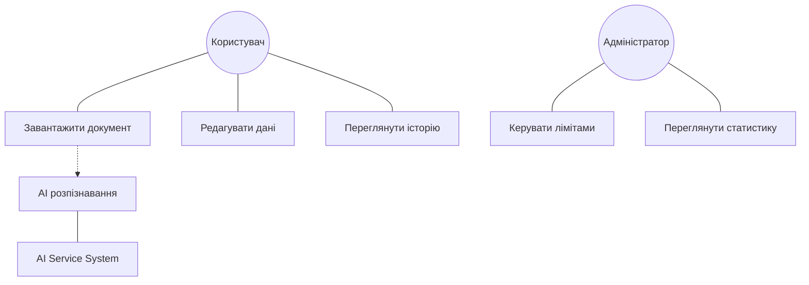
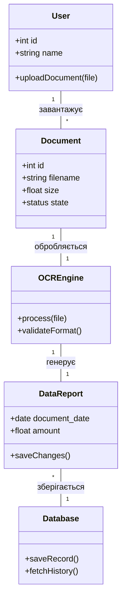
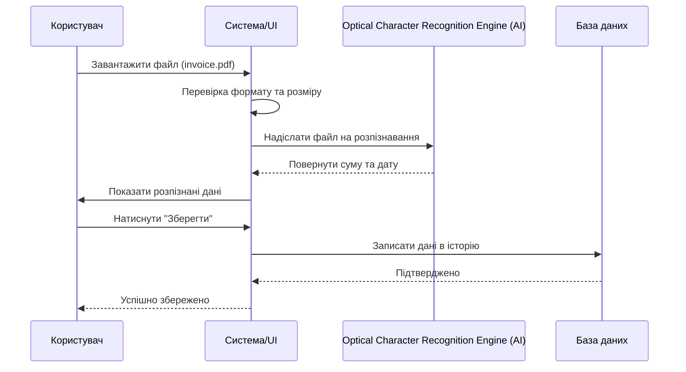

# Лабораторна робота №2: Проектування архітектури ПЗ
**Студент:** Ільченко Віталій  
**Проєкт:** SmartDoc AI (Система розпізнавання документів)

## 1. Функціональні вимоги (FR)
| ID | Опис вимоги |
|:---|:---|
| FR-01 | Користувач повинен мати можливість завантажувати файли форматів PDF, JPG, PNG до 20МБ. |
| FR-02 | Система повинна автоматично розпізнавати суми та дати за допомогою ШІ. |
| FR-03 | Користувач повинен мати можливість редагувати витягнуті дані перед збереженням. |
| FR-04 | Система повинна зберігати історію оброблених документів у профілі користувача. |
| FR-05 | Адміністратор повинен мати можливість переглядати статистику використання системи. |

## 2. Діаграма прецедентів-дій (Use Case)

## 3. Діаграма класів (Class Diagram)

## 4. Діаграма послідовності (Sequence Diagram)

## 5. Матриця трасованості-зв'язок (Traceability)
| FR ID | Назва вимоги | Прецедент | Класи | Діаграма послідовності |
|:---|:---|:---|:---|:---|
| FR-01 | Завантаження документів | Завантажити документ | User, Document | Сценарій завантаження |
| FR-02 | AI розпізнавання | AI розпізнавання | OCREngine | Сценарій обробки AI |
| FR-03 | Редагування даних | Редагувати дані | DataReport | Сценарій збереження |
| FR-04 | Зберігання історії | Переглянути історію | Database | - |
| FR-05 | Статистика системи | Переглянути статистику | User (Admin) | - |
